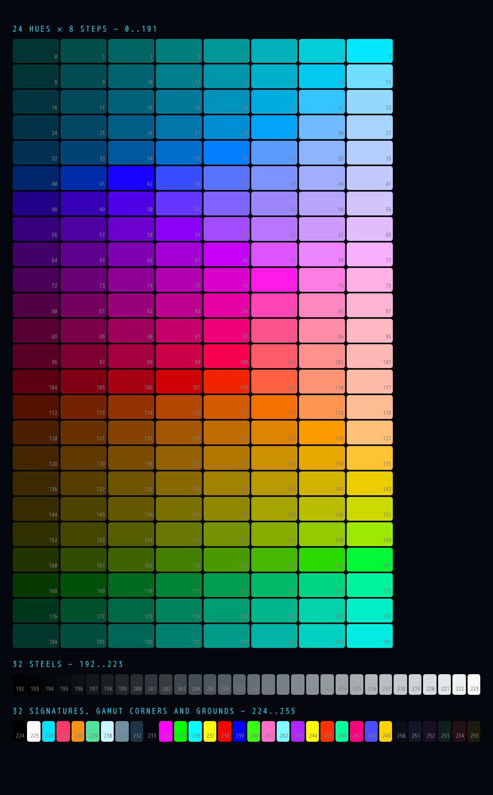

# DECK-0003: SNO (Simple Nostr Objects)

DECK: 0003
Title: SNO (Simple Nostr Objects)
Status: Draft
Created: 2026-09-14
Last updated: 2026-09-24
Requires: `CYBERSPACE_V2.md` (spec version `2026-03-16-h34-corrected`)

## Abstract

A **Simple Nostr Object** (SNO) is a small three-dimensional object written as JSON, small enough to live inside one nostr event alongside everything else a note carries. It is a list of vertices on an integer lattice, one color per vertex, an optional list of triangles, and a word saying how to draw it. There are no textures, no materials, no normals (a face's winding says which way it looks), no bones, no animation, and no file to fetch. An object is the event.

This document codifies a format Cyberspace already depends on but has never written down. The base specification refers to it twice: §7 notes that ONOSENDAI hides `kind 3330` shards whose geometry is in `content`, and §8.10 computes the proof of work an avatar owes from that payload's `unit`, `vertices`, `ticks` and `faces` fields. Both passages assume a format defined nowhere. This DECK is that definition, written so that it stands on its own outside Cyberspace as well as inside it.

The design goal is not to compete with glTF or USD. It is to be the three-dimensional equivalent of a text note: something any developer can parse in an afternoon with no library, read with their eyes, diff in a pull request, and render with thirty lines of code. Where a real asset pipeline is needed, SNO is the wrong tool and says so.

**Defined here:**

| Thing | Value |
|---|---|
| Object payload | JSON, described in §1 |
| Event kind for a standalone object | `33331`, addressable, one per author per `d` (§3.1) |
| Event kind for an object hidden in a bag | `3330` inline, as Cyberspace already uses it; by reference, the object's own `33331` event, named by a reference tag (§3.2, §3.4) |
| Model space | X right, Y up, +Z toward the viewer: right handed, the glTF convention (§2) |
| Position lattice | whole units plus 120ths of a unit (§1.2) |
| Size | no ceiling on vertices or faces; the event's size is the relay's concern, as for every other kind (§1.8) |
| Reference implementation | `decks/sno-reference.py`, which is §1.9 written as code |

**Conformance.** `decks/sno-reference.py` implements §1.9 with no dependencies and carries a rejection case for every numbered rule that rejects. It was checked against ONOSENDAI's independent TypeScript reader, and the two agree on every case, including the three places where this format is deliberately forgiving rather than strict. A third implementation can be checked against the same table.

---

## Terms

- **Object:** one SNO payload. A single connected budget of vertices, colors and faces; not a scene and not a hierarchy.
- **Model unit:** the lattice spacing. One model unit is `2^unit` of the application's base unit (§1.6). In Cyberspace the base unit is the gibson.
- **Tick:** one 120th of a model unit. The sub-unit part of a position (§1.2).
- **Vertex:** a point, its position given as whole units plus ticks, carrying one RGB color.
- **Face:** a triangle, three vertex indices.
- **Mode:** which of the three drawings of the same vertex list a client should produce: `solid`, `points` or `lines` (§1.5).
- **Extent:** the half-width of the grid the object was built on, in model units. A bound, not a size (§1.8).

---

## 1. The object (normative)

### 1.1 Payload

An object is a JSON object. Fields marked required MUST be present; a reader MUST reject a payload that is missing one or whose value has the wrong shape.

| Field | Type | Required | Meaning |
|---|---|---|---|
| `v` | integer | yes | Format version, `1` or `2`. They differ in one sign and nothing else (§2). A reader MUST support both and MUST reject any other value. |
| `type` | string | no | A legacy field. A reader MUST ignore it wherever it appears, and MUST NOT require it or reject on its value. A publisher SHOULD NOT write it (§1.1a). |
| `name` | string | yes | A name for humans. A reader MUST truncate to 64 characters. |
| `unit` | integer | yes | Scale exponent, `0` to `84`. One model unit is `2^unit` base units (§1.6). |
| `extent` | integer | no | Grid half-width in model units, `1` to `64`. Advisory and self-repairing (§1.8). Absent or malformed means `8`. |
| `mode` | string | yes | `"solid"`, `"points"` or `"lines"` (§1.5). A reader MUST reject any other value. |
| `vertices` | array | yes | One `[x, y, z]` triple of **whole units** per vertex (§1.2). |
| `ticks` | array | no | The sub-unit part of each position (§1.2). Absent means every position is whole. |
| `colors` | array | yes | One palette index per vertex, parallel to `vertices` (§1.3). |
| `faces` | array | yes | Triangles as `[a, b, c]` vertex indices (§1.4). MAY be empty. |
| `facecolors` | array | no | One palette index per face, run-length encoded, for hard color seams (§1.4a). Absent means every face interpolates its vertices. |
| `palette` | string or array | no | Which 256 colors the indices name (§1.3a). Absent means the built-in. |
| `up` | boolean | no | `true` means the object stands on the Earth's surface where it is placed (§1.7). `false` means the same as absent. |
| `spin` | integer | no | With `up`: the compass bearing the object's `+Z` faces, `0` to `359` (§1.7). |
| `refs` | array | no | Other objects this one places, each named the way a nostr tag names an event (§1.10). Absent means the object places nothing. |
| `parts` | array | no | Where each placed object stands, turns and scales, one entry per placement (§1.10). Absent means the same. |

`vertices` and `colors` MUST have the same length. Any field not listed here MUST be ignored by a reader, not rejected (§5).

### 1.1a Why there is no `type`

Payloads written before this document carry `type: "shard"`. This format has no such field, and that is worth a paragraph, because dropping a field that existing writers emit looks like carelessness and is the opposite.

The field never said anything the container did not already say. A standalone object is `kind 33331` and an object in a bag is a `kind 3330` item; either way the kind is what a reader dispatches on, and Cyberspace's own client derives "this is a shape, not a message" from the kind and has only ever used `type` as a sanity check on a blob it had already decided was a payload.

What the field did do was carry a parochial word into a format meant for anyone. "Shard" is Cyberspace's name for an object hidden at a place. It is a good word there and it means nothing in a format called Simple Nostr Objects, and a field whose only legal value is another project's vocabulary is exactly what makes a format look like somebody's internal file that escaped.

So there is no `type` in either version, no reader may require one, and no reader may reject on its value. A publisher should not write it. Nothing rejects a payload that carries one, because the field is noise and rejecting on noise would break every object already published.

### 1.2 Positions: the lattice and the ticks

A position is an exact rational, never a float. It is carried in two parts.

`vertices[i]` is the **whole units** part: three integers, the floor of the position on each axis.

`ticks[i]` is the **remainder**: three integers `0` to `119`, the position's fractional part in 120ths of a unit. The position on an axis is therefore `vertices[i][a] + ticks[i][a] / 120` model units, exactly.

`ticks` is run-length encoded, because most objects are built on whole units and a long list of `[0, 0, 0]` is waste. Each entry is either a triple, standing for one vertex, or a **negative integer** `-N`, standing for `N` consecutive vertices whose remainder is `[0, 0, 0]`. The entries, expanded, MUST produce exactly one remainder per vertex; a reader MUST reject a `ticks` array that expands to any other length. `0` and positive integers are not valid entries.

**Why 120.** It is the smallest number divisible by every integer from 1 to 6, and it also divides by 8, 10, 12, 15, 20, 24, 30, 40 and 60. Halves, thirds, quarters, fifths, sixths, eighths and tenths of a unit all land exactly on the lattice, so a modeler snapping to any ordinary fraction never accumulates error, in the same way that 360 degrees was chosen for a circle. A power of two would have made thirds and fifths impossible.

**Why integers at all.** A vertex is at a coordinate, not near one. Two objects built to meet at a shared edge meet exactly, on every implementation, forever, with no dependence on floating point rounding or on the order the file was written in.

**The float hazard (normative).** One 120th is not exactly representable in binary floating point. Two readers that compute `whole + remainder / 120.0`, one in 32-bit and one in 64-bit, will disagree in the last bits. Therefore any operation that depends on exact coincidence, which is at least welding, deduplication, equality, sorting and hashing, MUST be performed on the integer pair before any conversion to a float. A reader that welds on derived floats has given away the one guarantee the lattice makes.

**Canonical form (normative).** There is exactly one way to write a given object, because a format that allows three spellings of the same thing gets three incompatible readers. A publisher MUST omit `ticks` entirely when every remainder is zero, MUST write a run of two or more zero remainders as a single negative integer rather than as repeated triples, and MUST omit `extent` when it is `8`. A reader MUST accept all equivalent spellings anyway, because it will meet them.

### 1.3 Colors

`colors[i]` is a single integer: an index into the object's palette (§1.3a). There is one per vertex, parallel to `vertices`. A reader MUST reject an index that is not an integer, is negative, or is not less than the palette's length.

**In a `v: 1` payload `colors[i]` is a literal `[r, g, b]` triple of numbers from `0` to `1`,** clamped on read, with no palette involved. Version 1 predates the palette and every object written before this document is one of them, so this is not a compatibility shim but what version 1 has always meant, alongside the Z flip of §2. A reader MUST take a `v: 1` color exactly as written rather than snapping it to the nearest palette entry: snapping on read would change objects nobody asked to change. It snaps when it is next published, which is when it becomes a `v: 2` payload. A publisher MUST NOT write triples.

There is one color per vertex and, apart from `facecolors` (§1.4a), no other color anywhere in the format. A face with no color of its own is painted by interpolating its three vertices; a line is painted by interpolating along its length; a point is its own color. **Interpolation happens after the lookup**, between the two resolved colors, so indexing costs nothing in smoothness: a gradient across a triangle is as continuous as it ever was, and the index is only how its endpoints are named.

**Why an index and not three numbers.** Color was the largest cost in this format by a wide margin and it was buying nothing. Three numbers at four decimal places is 21 bytes of the 52 a worst-case vertex costs; an index is 4. Measured over a whole serialized event at the format's ceiling, with a color on every face, that is 62.6 KB against 33.5 KB, on a wire whose tightest common limit is 65,536 bytes (§1.8). Face colors were unaffordable and are now nearly free.

Nothing is lost visually. A palette entry is eight-bit-per-channel color, which is what a screen shows and what PLY, PNG and every common exchange format store. What is given up is an object using more than 256 distinct colors at once, and an object that needs more than 256 distinct colors is not the kind of object this format is for.

| | bytes per vertex | 512 vertices, 1024 faces | with a color on every face |
|---|---|---|---|
| three numbers at full precision | 87 | 57.1 KB | 115.1 KB, over every relay |
| three numbers at four decimals | 52 | 39.6 KB | 62.6 KB |
| **a palette index** | **32** | **29.9 KB** | **33.5 KB** |

At 32 bytes a vertex only about 4 are the color, so this is the last large saving available in color. Anything further would have to change how positions are encoded.

### 1.3a The palette

`palette` says which 256 colors an object's indices refer to.

| `palette` | Meaning |
|---|---|
| absent | the built-in, `cyberspace-neon-256` (Appendix C) |
| a registered name | `"cyberspace-neon-256"` is the only one, and is the default |
| an `nevent1…` or `naddr1…` | a palette published as its own nostr event, fetched if it can be, with the built-in standing in until it is (§1.3b) |
| an array | a palette carried in the object itself: 2 to 256 entries, each `[r, g, b]` of three integers `0` to `255` |

A reader MUST reject a `palette` that is an array of fewer than 2 or more than 256 entries, or any entry that is not three integers in `0..255`, or a string that is neither a name it knows nor a well-formed `nevent` or `naddr`.

**Why a custom palette may be short.** An object with four colors pays for four, not for 256. Two entries cost 40 bytes, sixteen cost 222, and a full 256 costs 3.3 KB, so the cost lands where it is affordable: 3.3 KB is four times the size of a cube and a sixth of an object at the ceiling, and it is large objects that want a palette of their own.

### 1.3b A palette published as its own event

A `palette` of `nevent1…` or `naddr1…` names a nostr event that carries a palette. This is how a group of objects share one set of colors, and how this format meets the palettes that already exist on nostr rather than insisting everyone reuse its own.

**The rule that makes this safe is that a reference is never load-bearing.**

1. A reader MUST render the object without waiting for anything. Until the referenced event is in hand, the indices name the built-in.
2. A reader MAY fetch the event, and SHOULD if it can do so without blocking the first frame. When it arrives and it parses, the reader re-renders with it.
3. A reader that cannot fetch, or fetches an event that is not a palette, MUST keep drawing with the built-in and MUST NOT reject the object.

So the worst case is an object drawn in the wrong colors, never an object that cannot be drawn. That is a real cost and it is stated here rather than buried: a viewer has no way to tell that the colors it sees are the fallback rather than the author's. A publisher who cannot accept that carries the palette inline, which is what the array form is for, and which is what a small palette should do anyway.

**A palette event carries its colors in `c` tags, one tag per color, and the order of the tags is the index.** A publisher MUST write the colors that way and MUST NOT write a second machine-readable copy of them anywhere else in the event. `c` tag `n`, counting from zero in the order the tags appear in `tags`, is the color that index `n` names. A value is `#rrggbb`. Two to 256 of them.

Everything else in the event is for people. `name` is what the author calls the palette, `alt` is NIP-31's line for a client that cannot render it, `client` says what published it, and `content` may hold whatever a color-moment client would want there, an emoji or a sentence, or nothing at all. None of it is read for colors.

**What counts as a palette event (normative).** Given an event it has fetched, a reader MUST take the first of these that succeeds.

1. **The `c` tags**, in the order they appear in `tags`, if there are 2 to 256 of them and every value is a well-formed `#rrggbb`. Their order is the palette's order.
2. Otherwise, **`content`**, if it parses as a JSON array of 2 to 256 entries where every entry is either `[r, g, b]` of three integers `0..255` or a `"#rrggbb"` string. This is a legacy form and a reader accepts it only because an earlier draft of this section described it; nothing SHOULD write it now.
3. Otherwise the event is not a palette event, which counts as a failed fetch, which means the built-in.

The kind is deliberately not constrained. This format does not define a palette kind and does not want one: palettes on nostr are somebody else's problem and partly solved already, and a reader that accepts the shape above will read whatever convention wins without this document being revised. `kind 3367`, the color-moment convention, is what carries them today.

**Why the tags are the encoding and not `content`.** Three reasons, in the order they should be weighed.

1. **A single-letter tag is indexed by relays and `content` is not.** With the colors in `c` tags, `{"#c": ["#FF0000"]}` is a filter that finds every palette containing pure red, on any relay, with no new index and no new kind. A palette in `content` is opaque to every relay that stores it and can only be found by fetching it first. Nothing else in this section buys a capability that did not exist before; this does.
2. **One spelling.** The canonical form rule of §1.2 exists because a format that allows two spellings of one thing gets two incompatible readers, and colors in both the tags and the content would have been exactly that: the same information twice, with a rule needed to say which copy wins when they disagree.
3. **It is what the network already publishes,** which means an SNO palette is a color moment and a color moment is an SNO palette, with no translation and no second audience to write for.

Size does not decide this and should not be read as if it did. A 256-color palette is 4,618 bytes as tags with an empty content, against 3,691 for the dual form that was considered and rejected here, six tags as a preview with a JSON copy of the whole palette in the content, and no relay surveyed advertises a tag limit anywhere near 260 tags: of nos.lol, relay.damus.io, relay.primal.net, relay.nostr.band, ditto.pub and cyberspace.nostr1.com, only cyberspace.nostr1.com advertises `max_event_tags` at all, at 10,000.

**What the survey found, and what this section used to say.** Until 2026-09-16 this section said that a palette event's colors were a JSON array in `content`, and that the reference was an `naddr`. Both were guesses, made before anyone had looked at a real one, and both were wrong. A survey of five relays for `kind 3367` returned 205 unique events from 51 pubkeys, and every one of them carries its colors as `c` tags, one tag per color, in document order, with an emoji or a short note in `content`. All 661 `c` values are well-formed `#rrggbb` and none is malformed. Alongside them are `layout`, `alt` and `client` on all 205, `name` on 152 and `g` on 33. The palettes are small: 178 carry three colors, 14 carry four, 7 carry five, 6 carry six. So the content-only rule would have rejected every palette on the network, which is the opposite of meeting palettes that already exist. Kind 3367 is also in NIP-01's regular range of 1000 to 9999, which is stored and immutable and has no address, so the `naddr` this section asked for could not have named one of these events even in principle.

**Editing a palette publishes a new event.** A regular event cannot be replaced, so a corrected palette is a second event rather than a new version of the first, and the link back is carried in `e` tags. A publisher correcting a palette MUST write `["e", "<previous event id>", "<relay hint>", "previous"]`, and where it knows the first version of the palette SHOULD also write `["e", "<first version id>", "", "genesis"]`. Those two marker words are the ones Cyberspace's own action chain uses, so an implementer who has read anything else in this repository already knows what they mean. Together they make a history a reader MAY walk backward: `previous` gets the step before, `genesis` gets the start without walking at all.

**A reference is pinned to the event it names.** A reader MUST NOT follow the `e` chain forward to a newer version, and MUST render the object with the event the object names. This is the part that is better than the addressable form this section proposed before, and it is worth saying why rather than leaving it as a consequence of the kind. An immutable event means an object renders the same forever, and an author who corrects a palette cannot silently repaint every object that ever named it, including objects belonging to people they have never met. The cost is that an object does not pick up a correction on its own: it picks one up when its own author republishes it pointing at the new event, which is a deliberate act by the one person entitled to change how that object looks.

**Why an event id rather than an address.** An `nevent` carries the id and relay hints, so a reader has somewhere to look, and it names one immutable event, which is what the pinning rule above needs. An `naddr` is still accepted, for a palette somebody publishes as an addressable event of their own; once the event is fetched the shape rules above apply to either, and the pinning rule applies to whatever the reader has in hand. What an `naddr` cannot do is name a `kind 3367`, which is where the palettes are.

**The built-in is not a compromise default.** It is 24 hues of 8 steps, then 32 steels, then 32 signature colors, laid out so that index arithmetic is legible: `hue * 8 + step` for the first 192. The ramps are generated in OKLCH, which spaces them by how different they look rather than by their numbers, and clipped into sRGB by lowering chroma rather than clamping channels, which is what keeps the bright end from turning to mud. Appendix C carries the whole list.

### 1.4 Faces

`faces[i]` is `[a, b, c]`, three integers indexing `vertices`. Every index MUST be at least `0` and less than the vertex count, and the three MUST be distinct. A reader MUST reject a payload containing any face that fails either test, because a face pointing at a vertex that does not exist is a crash in most renderers, far from anything that could explain it.

**Winding order is a face's front.** For a face `[a, b, c]` the front is the side that the normal `(b - a) × (c - a)` points to, computed on the positions in the frame of §2 (after the version 1 negation, for a version 1 object). Seen from the front, the corners run counter-clockwise, which is the glTF, three.js, OpenGL and Blender convention, so an exporter from any of them writes its faces in the order it already holds them. This is how an object says which way each face looks, at a cost of zero bytes: the order of three indices is on the wire whatever it means.

A reader MUST take a face's front from its winding and MUST NOT infer it: not from the object's shape, not from where the origin sits, not from the side the viewer is on. Inference cannot be right for an open sheet, which has no inside to point away from, and two readers that infer differently show one object as two.

A reader MUST still draw both sides of every triangle and MUST NOT cull a face on the basis of its winding. It MAY draw a back darker than a front, and a reader that lights an object SHOULD, so that an author can see a face that looks the wrong way. Culling is refused because an object is often an open shell, and culling would make it vanish from behind.

This section was, until 2026-09-24, the opposite rule: winding carried no meaning and a face had no front. That was chosen so that no author would ever have to think about winding. It was reversed because readers that light objects had to guess each face's front, and a guess that is wrong for a flat plate turned half of a published object dark on one reader and not on another. Authoring tools carry the burden instead: they SHOULD wind new faces outward by default and SHOULD give the author a way to turn a face round.

This is stated because leaving it unsaid is the most common way a small format fails. STL left color unspecified and two vendors filled the hole incompatibly; PLY never registered its property names and cost the ecosystem years of colors that did not import; Niantic's SPZ shipped in 2024 without saying which axis is up and someone had to file an issue to ask.

`faces` MAY be empty. An object with no faces is a point cloud or a polyline, depending on `mode`.

### 1.4a Face colors, and hard seams

A face with no color of its own takes one by interpolating its three vertices, which is a gradient across the triangle. That is the right default for a lit, rounded object and the wrong one for the blocky work this format suits best, and until now the only way to get a flat triangle was to give all three of its vertices the same color. Two flat triangles meeting at an edge then need six vertices where the geometry needs four, and a flat-shaded 500-triangle object spends 1,500 vertices to express 500 colors: three times over the budget of §1.8. The format made its own best style its most expensive.

`facecolors` is one entry per face, in the order `faces` gives them.

**When a face has a color, that color fills the whole triangle** and its vertices contribute nothing to the fill. Vertex colors are untouched and still color the points and the lines (§1.5), so an object may carry both without contradiction and `points` and `lines` mode behave exactly as they always did.

**Run-length, as `ticks` does it (§1.2), because the common case is a run.** A stamped block is twelve triangles of one color. An entry is either a **palette index**, a non-negative integer read exactly as §1.3 reads one, or a **negative integer** `-N` standing for N further faces of the index before it. A solid cube whose color is index 7 is therefore `[7, -11]`. The first entry MUST be an index, since a run has nothing to repeat before one. The entries, expanded, MUST produce exactly one color per face; a reader MUST reject a `facecolors` array that expands to any other length.

The sign is what separates the two kinds of entry, and it works because an index is never negative. This is the same trick `ticks` uses and it is why color had to become a single number before face colors could be affordable: a list of triples interleaved with run markers cost more than it saved.

The canonical form of §1.2 extends unchanged: a publisher MUST write a run of two or more as the shorthand, so there is still exactly one way to write a given object.

**What this does not do, deliberately.** It gives a hard seam between faces, not a gradient inside a face with a hard edge along one of its sides. That would need a color per face corner, three per face, which triples the color data to buy a case this format's audience does not have. Lines keep interpolating along their length; per-edge color would be a third mechanism and is not worth one.

### 1.5 Mode

`mode` says which drawing of the vertex list is the intended one. All three are drawings of the same data, so mode is a property of the object and not of the viewer.

| Mode | Drawing |
|---|---|
| `solid` | the triangles in `faces`, colors interpolated across each face |
| `points` | the vertices, each at its own color |
| `lines` | the edges of the faces, each drawn once, colors interpolated along each edge; with no faces, one polyline through the vertices in order |

A client SHOULD also draw the vertices as points in every mode, so that an object remains visible when it is smaller on screen than a triangle.

### 1.6 Scale

`unit` is an exponent, not a size. One model unit is `2^unit` base units, and the application decides what a base unit is. In Cyberspace a base unit is one gibson, the smallest addressable length, so a `unit` of `0` builds on a lattice one gibson wide and a `unit` of `33` builds on a lattice of meters.

This is why the same geometry serves a trinket and a monument: an object is written once and scaled by changing one integer, with no re-quantization and no loss.

An application outside Cyberspace that has no natural base unit MAY treat `unit` as a relative scale only, and SHOULD render an object at a size that suits its context rather than refusing it.

### 1.7 Standing on Earth

`up`, when present, MUST be a boolean; a reader MUST reject any other type. `true` means the object is oriented against the surface of the Earth at the point where it is placed: the object's `+Y` axis points along the geodetic normal (local up), its `+X` points local east, and its `+Z` points local north. Absent, an object's axes are the application's axes.

`spin` is a whole number from `0` to `359`: the compass bearing the object's `+Z` faces, measured clockwise from north as seen from above. `0` faces north, `90` east, `180` south, `270` west. Absent with `up` true means `0`.

A reader MUST reject a `spin` that is present and is not an integer in range, whether or not `up` is present, because a payload carrying a nonsense bearing is malformed even where the bearing is unused. A reader MUST ignore the value of `spin` when `up` is not `true`.

The frame is right-handed in Cyberspace's axes. This is not obvious and is worth stating: the canonical GPS mapping (`CYBERSPACE_V2.md` §9.4) swaps the ECEF Y and Z axes, which mirrors the frame, so (east, up, north) comes out right-handed in Cyberspace where it would be left-handed in ECEF.

A reader that does not implement `up` draws the object in the application's axes and is not wrong, only unoriented.

### 1.8 Limits

| Limit | Value | Why |
|---|---|---|
| vertices, faces, refs, parts | **none** | the size of an event is the relay's concern, as it is for every other kind of event; see below |
| nesting depth | 4 | how far a reader follows placements (§1.10). A bound on the reader's work, not on the object |
| `extent` | 1 to 64 model units | a hint at the lattice size, so a reader can size a grid before it reads the data |
| `unit` | 0 to 84 | the Cyberspace address space is `2^85` gibsons on a side |
| `name` | 64 characters | truncated, not rejected |

**There is no ceiling on vertices or faces.** A reader MUST NOT reject a payload for its vertex or face count. Until 2026-09-24 this format set 512 vertices and 1,024 faces, sized so that the worst object it permitted fit a stock relay. It was removed because no other event kind bounds its own content: a long-form article, a file header, a wiki page are as large as their author makes them, and the relay that stores an event decides what it will take. That is a different class of problem from the one a format solves, and a format that solves it anyway puts a number between the author and the thing they were making. The number did that: a 129-square floor pasted square by square reached 516 vertices, deployed, and was opened as nothing by every reader (arkinox, 2026-09-24), and a figure or a vehicle at ordinary low-polygon detail needs 600 to 1,000 and was impossible however well it was built.

What replaces the ceiling is a publisher who knows what things cost and a container that stops multiplying: an object of any size can have an event of its own (§3.1, §3.4), so a bag, which is one event shared by everything hidden at a place, need never grow with the objects it names. The rest of this section is the arithmetic, so a publisher can plan against the relays it uses; none of it is a rule.

`extent` is **advisory and self-repairing**, which is the one place this format is deliberately forgiving. A reader MUST substitute the default of `8` for an `extent` that is absent, not an integer, or outside `1..64`, and MUST then grow it until it contains every vertex. An object is therefore never rejected for disagreeing with its own extent; the data wins and the hint is corrected. This is what lets a modeling tool write geometry first and a bounding hint second without the two ever contradicting.

The position bound is stated as an obligation on publishers rather than readers: a publisher MUST NOT write a vertex further than `64` model units (`7680` ticks) from the origin on any axis. A reader MAY reject such a payload and MAY instead repair it by growing the extent. ONOSENDAI currently repairs. §8 records the consequence.

**What things cost (non-normative).** strfry's stock `events.maxEventSize` is 65,536 bytes, and strfry is the most deployed relay software in the network; a relay's operator may raise it, and the ones this world runs on have (below). What a full serialized event costs at 512 vertices and 1,024 faces, the format's former ceiling and still a useful yardstick, worst case throughout, with coordinates at the extent bound and every field at its most expensive:

| At 512 vertices and 1024 faces | No `facecolors` | With `facecolors` |
|---|---|---|
| **palette indices, the built-in (§1.3)** | **29.9 KB** | **33.5 KB** |
| plus a full 256-entry custom palette | 33.1 KB | 36.7 KB |

Both fit with room to spare, and face colors now cost 3.6 KB rather than doubling the object. Two earlier drafts of this section did not: three numbers per color at four decimal places reached 62.6 KB with face colors, and at full double precision 115.1 KB, which is over every relay in the network. §1.3 carries that comparison, because it is the whole reason color is an index.

The cost is now dominated by geometry rather than color. Worst case, a vertex costs 32 bytes, of which about 4 are its color; a face costs 13, and a face that carries its own color 17. A publisher that wants the largest possible object spends its budget on vertices.

A real object is far below that, because the worst case above assumes every position needs its sub-unit part written out and every face carries a color of its own. An object built on whole units, which is what the lattice is for, compresses its `ticks` to a single number and its `facecolors` to one run:

| A typical object, whole units, the built-in palette | Full event, serialized |
|---|---|
| a coloured cube, 8 vertices | about 730 bytes |
| 64 vertices, 128 faces | 2.5 KB |
| 256 vertices, 512 faces | 9.4 KB |
| **512 vertices and 1024 faces** | **18.9 KB** |

One color per face adds almost nothing to these, because a run of identical faces is two numbers whatever its length.

These numbers are the whole argument for the change in §1.3: the same object that cost 29.4 KB with three numbers per color costs 18.9 KB with an index, and the ceiling that fits a 56 KB budget with a color on every face moved from 448 vertices to 832.

Two facts make this margin more comfortable than it looks. Escaping the payload into a JSON string costs about 12 bytes, under 0.05%, because the content is almost entirely integers, so the fear that nesting JSON inside JSON is wasteful does not apply here. And the geometry belongs in `content` rather than tags: strfry caps a tag value at 1,024 bytes and the tag count at 2,000, while content is roomy everywhere.

**The relays in use, measured 2026-09-24** (NIP-11 `max_message_length`): cyberspace.nostr1.com **262,200** bytes; nos.lol 131,072; relay.primal.net and relay.damus.io 1,000,000. Worst case a vertex costs 32 bytes and a face 13, or 17 with a color of its own; a typical whole-unit object costs about a third of that. So the world's own relay takes a worst-case object of about 3,500 vertices, or a typical one of about 10,000, standing alone; a stock relay takes about 800 worst case. A publisher who knows its relays can size to them; one who does not should publish and read the refusal, which names the reason.

**A bag is the one place size still multiplies.** Everything hidden at one place by one author travels in one event, encrypted and base64'd, so three large objects inline are three times the size and the bag fails before any object would alone. §3.2 and §3.4 give every object the option of an event of its own; a publisher SHOULD take it for anything large, and the bag then stays small however much stands at the place.

One trap worth knowing, since it cannot be discovered at runtime: strfry populates NIP-11's advertised `max_message_length` from its WebSocket frame cap, not from `events.maxEventSize`, and never advertises the latter. A relay advertising a one megabyte limit may still reject a 70 KB event. Do not design against advertised numbers; stay under the ceiling and handle the rejection message.

### 1.9 Validation

A reader MUST perform all of the following before rendering, and MUST reject the whole payload if any fails. A partially valid object is not rendered partially: a face index pointing past the end of the vertex list is not a defect that degrades gracefully.

1. `v` is `1` or `2`. A `type` field, if present, is ignored and never rejected on (§1.1a).
2. `vertices`, `colors` and `faces` are arrays, and `vertices.length === colors.length`.
3. There is no bound on `vertices.length` or `faces.length` (§1.8). The number is kept so the rules below keep their names; until 2026-09-24 it read `512` and `1024`.
4. `mode` is one of the three words.
5. `unit` is an integer in `0..84`.
6. Every vertex triple is three integers.
7. `ticks`, if present, expands to exactly one remainder per vertex, and every remainder component is an integer in `0..119`.
8. Every face is three distinct integers in `0..vertices.length - 1`.
8a. `palette`, if present, is the name of a known built-in, a well-formed `nevent` or `naddr`, or an array of 2 to 256 entries of three integers `0..255`. A reference that has not been resolved counts as the built-in for the rules below, and is never a reason to reject (§1.3b).
8b. in a `v: 2` payload, every entry of `colors` is an integer from `0` to one less than the palette's length; in a `v: 1` payload, every entry is three numbers (§1.3).
8c. `facecolors`, if present, expands to exactly one index per face, its first entry is an index, every run entry is a negative integer, and every index is in range.
9. `extent`, if present, is repaired rather than validated (§1.8): out of range becomes `8`, then it grows to contain the data.
10. `up`, if present, is a boolean; `spin`, if present, is an integer in `0..359`.
11. `refs`, if present, is an array whose entries are each `["e", <64 lowercase hex>]` or `["a", "33331:<64 lowercase hex>:<d>"]`, optionally followed by one relay URL (§1.10).
12. `parts`, if present, is an array whose entries are each eight integers: a `refs` index in range, three tick offsets each in `-7680..7680`, three whole degrees each in `0..359`, and a scale step such that the placed object's unit stays in `0..84` (§1.10). `parts` without `refs`, or a `refs` index past the end, is a reason to reject.
13. A payload with `parts` and no `vertices` of its own is valid: an object may be nothing but the arrangement of others (§1.10).

---

### 1.10 Parts: one object placing others

**An object MAY place other objects.** `refs` names them; `parts` says where each stands. A reader that supports this section draws the parent's own geometry and then each placed object at its placement; a reader that does not, or that cannot fetch a placed object, draws the parent's own geometry and a placeholder where each part would stand, and MUST NOT reject the parent for it.

**`refs` is a list of nostr references, written the way a tag writes them.**

```json
"refs": [
  ["a", "33331:<pubkey hex>:<d>", "wss://relay.example"],
  ["e", "<event id hex>"]
]
```

An `a` reference names an addressable object (§3.1) and follows its author's newest version: fix the tile and every floor built from it changes. An `e` reference names one event, as a palette reference does (§1.3b), but an object is addressable, and NIP-01 lets a relay discard every version but the newest; most do. An `e` to a version its author has since replaced may therefore find nothing and be drawn as a placeholder. A publisher SHOULD write `a`. An author who wants a build no one else can change copies the object, publishes the copy under their own key, and places that. A reader MUST still read both shapes. The relay URL is a hint, as in NIP-01, and MAY be omitted. `refs` names each object once; a reader MUST reject a payload whose `refs` entry is not one of the two shapes above.

**`parts` is a list of placements, eight integers each.**

```json
"parts": [
  [0,  0, 0, 0,   0, 0, 0,   0],
  [0,  240, 0, 0, 0, 90, 0,  0],
  [1,  120, 0, 120, 0, 0, 0, -1]
]
```

| Position | Meaning |
|---|---|
| 0 | index into `refs`: which object |
| 1, 2, 3 | where its origin stands, in the parent's **ticks** (§1.2), so `120` is one whole unit; each in `-7680..7680`, the 64-unit position bound of §1.8 |
| 4, 5, 6 | its turn about its own origin, whole degrees `0..359` about the parent's X, then Y, then Z axes, in that order, in the right-handed frame of §2 |
| 7 | scale step: the placed object is drawn at `2^(its unit + step)` base units per model unit. `0` keeps its own size; `1` doubles it; `-1` halves it. The result MUST stay in `0..84` |

Positions are ticks and turns are whole degrees because everything else in this format is an integer and the canonical form of §1.2 depends on it. Multiples of `90` keep a placed object on the lattice exactly; other angles are permitted and are drawn as the renderer's floating point allows, which is what §4 already says of ticks. The scale is a power of two because `unit` is (§1.6): a step is exact, a free multiplier is not.

**Why the placements are in the payload and not in the event's tags.** A copy of the payload is the whole object, on the clipboard, in a bag, in another client; placements carried as tags would fall off it. Inside a bag the tags are encrypted with everything else, so nothing would be gained there. A publisher of a public `kind 33331` SHOULD also write each `refs` entry as an `e` or `a` tag on the event, unchanged, so a relay can answer "what places this object" (`#a`, `#e`); a reader MUST take the placements from the payload and MUST NOT read them from tags.

**What a placed object keeps and what it loses.** It keeps its own `palette`, `mode`, `facecolors` and geometry: it is drawn as its author drew it. It loses `up` and `spin`, because the parent's placement decides where it stands and which way it faces, and a parent standing on the Earth (§1.7) carries its parts with it. Its `extent` is ignored; the parent's extent is repaired to contain the placed objects' bounds the same way it is repaired to contain vertices (§1.8), which a reader can only do once the parts are fetched, so a parent's advertised extent may be smaller than what is finally drawn.

**Depth and cycles.** A placed object may itself have parts. A reader MUST follow placements no deeper than `4` levels from the object it is rendering, drawing a placeholder in place of anything deeper, and MUST treat a reference to any object already in the chain of parents as missing. Both are bounds a reader can enforce without trusting the author, which is the only kind worth writing down.

**A missing part is a placeholder, never a rejection.** A reference that cannot be fetched, has been deleted, fails §1.9, or is deeper than the bound is drawn as a placeholder at its placement: a wireframe cube one whole unit on a side in the reader's accent is the reference behavior, and a reader MAY do better. The parent is unaffected. This is the same stance §1.3b takes for a palette that cannot be resolved, and for the same reason: another author's event is not this object's to guarantee.

**What this buys, in bytes.** An `a` reference is about 110 bytes and an `e` reference about 78; a placement is 28 at most. Twelve palm trees as twelve inline copies cost 396 vertices; as one tree and twelve placements they cost 33 vertices and about 450 bytes. The 129-square floor that motivated this cost 516 vertices pasted and 291 welded; as one tile and 129 placements it is about 3.7 KB and 4 vertices of its own, and the tile's author can repaint every floor built from it in one edit.

**Groups are objects (non-normative).** A modeling tool wants to select, move and edit a group of vertices as one thing, and every such tool grows a grouping mechanism. This format has none, on purpose: a group is an object, placed. A client is expected to show an object's parts as things a person can pick (a tray of what is on the bench), isolate one, and edit it. A part that belongs to the person editing is edited in place, and because it is addressable every parent that places it follows; a part that belongs to someone else is cloned under the editor's own key and the placement repointed, which is what "editing someone else's tile" honestly is. None of that is protocol, and none of it needs to be.

**Versioning.** `refs` and `parts` are fields whose absence has a meaning, so their addition does not bump `v` (§5). An older reader ignores them and draws the parent alone.

## 2. Model space (normative)

An object is built in a right-handed frame with Y up, which is the glTF and three.js convention:

| Axis | Direction |
|---|---|
| `+X` | right |
| `+Y` | up |
| `+Z` | toward the viewer |

This is stated first and in normative language because being silent about it is the most common way a small format fails. STL never specified color and two vendors filled the hole incompatibly. PLY never registered its property names. glTF left "forward" undefined for years while being an ISO standard. Niantic's SPZ shipped in 2024 without saying which axis is up, and someone had to open an issue to ask.

**Version 1 and version 2 differ by one sign and one color encoding, and by nothing else.**

| `v` | Z points | A reader |
|---|---|---|
| `1` | away from the viewer | MUST negate every Z on read, which renders the object exactly as its author built it. Its colors are literal triples (§1.3) |
| `2` | toward the viewer | reads the positions as written. Its colors are palette indices (§1.3) |

Version 1 is the convention this format had while it lived only inside Cyberspace, where `+Z` is the direction of the black sun. Every object published before this document exists under it, and negating Z on read is what keeps those objects looking as they always have. A publisher MUST write `v: 2`; `v: 1` is for reading what already exists.

The flip was made deliberately and once. Carrying Cyberspace's own axis convention into a format meant for anyone would have charged every exporter and importer, forever, for a mirroring that only Cyberspace needs. Cyberspace applies it where it belongs, in the one renderer that places an object into its world, rather than in every tool that ever writes one.

A mirror turns every front into a back (§1.4). A reader or tool that carries an object through one, whether converting into a left-handed frame or placing an object into a world drawn with an axis negated, MUST reverse the order of every face in the same step, or read the front in the frame of §2 before mirroring. A rotation keeps every front a front. The version 1 negation needs no reversal: §1.4 reads the front after it, and version 1 winding was never authored.

A Blender exporter therefore maps Blender `(x, y, z)` to SNO `(x, z, -y)`: Blender is Z-up and right-handed, SNO is Y-up and right-handed, and the negation is what keeps the frame right-handed rather than mirroring it. §7 returns to this.

---

## 3. Carrying an object in a nostr event (normative)

### 3.1 A standalone object: `kind 33331`

An object stands alone as a `kind 33331` event whose `content` is the payload of §1, serialized as JSON.

| Tag | Required | Meaning |
|---|---|---|
| `d` | yes | the object's identifier, chosen by its author and stable across edits. The workshop's own id for the object serves |
| `name` | no | `["name", "<name>"]`, duplicating the payload's name so a relay query can filter on it without parsing the content |
| `alt` | no | a description for clients that cannot render an object (NIP-31) |

`33331` falls in `30000..39999`, which NIP-01 defines as **addressable**: relays keep the newest event per `(pubkey, kind, d)`, so an author edits an object in place by republishing it under the same `d`. That is the right class for a thing someone iterates on in a modeling tool, which is what an object is.

It costs something, and the cost is worth stating plainly rather than discovering later. Reactions (NIP-25), zaps (NIP-57) and comments (NIP-22) reference an event id, and an address resolves to whatever its author last published, so a payment made against an object can end up pointing at content that changed after it. An application that needs an object to be immutable, because it was paid for or because it was hidden somewhere and must stay as it was found, uses the bag item of §3.2, whose kind is regular.

**Exactly one kind, never two.** NIP-71 shipped both a regular and an addressable video kind and it is widely regarded as a mistake. There is no regular twin of `33331` and there should never be one.

A client that receives a `kind 33331` event whose content fails §1.9 MUST NOT render it and SHOULD say why rather than failing silently.

### 3.2 Inside a bag

An object hidden at a place is an entry in a `kind 33330` bag, exactly as `CYBERSPACE_V2.md` §7.6 describes entries. It is carried in one of two ways:

- **Inline:** an item, a `kind 3330` event, signed or unsigned, with the payload of §1 in its `content`. It MAY carry a `C` tag, which then MUST lie inside the bag's region. This is how every object was carried before 2026-09-24 and it stays the right way for small ones.
- **By reference:** a reference entry (`CYBERSPACE_V2.md` §7.6) naming the object's own `kind 33331` event (§3.4): `["a", "33331:<pubkey>:<d>", "<relay hint>", "<coord_hex>"]`, which follows the object as its author edits it. `33331` is addressable, so an `e` reference to it would stop resolving as soon as its author replaced it (`CYBERSPACE_V2.md` §7.6); a reference to an object uses `a`. No `kind 3330` event is involved. A `pubkey` in the address that differs from the bag's author is not a reason to reject: placing another author's object is a placement. A reader MUST fetch the referenced event and read the object from it as §3.4 says; a reference that cannot be fetched is a missing entry, dropped like an item that fails to verify, and a client SHOULD say so rather than say nothing was found.

A publisher SHOULD carry a large object by reference: a bag is one event shared by everything hidden at a place, and by reference it stays small whatever the object costs. What counts as large is the publisher's judgment against the relays it publishes to (§1.8); the format draws no line. A publisher MAY carry a small object by reference too, when it wants the object to have an event of its own.

`3330` is regular, and deliberately so. An item in a bag is a thing someone hid at a place and someone else found there; it must be exactly what it was when it was found, and its id must keep meaning what it meant. The same payload therefore travels under two kinds according to what is being done with it: `33331` for an object its author is still working on, `3330` for one that has been put somewhere. That is two containers for one format, not two ways of writing the format. A reference follows a `kind 33331` object as its author edits it; an object that must stay exactly as it was found is carried inline as a `3330` item, the one form no later edit can reach.

### 3.3 As an avatar

An avatar event (`kind 11333`, `CYBERSPACE_V2.md` §8.10) carries an SNO payload in its `content`, or empty content for the default avatar. The work an avatar owes is computed from `unit`, `vertices`, `ticks` and `faces` as that section specifies. Nothing in this DECK changes that computation; this document only defines the fields it reads.

### 3.4 A hidden object as its own event

**A hidden object carried by reference is a `kind 33331` event whose payload is encrypted to the place.** It is the standalone container of §3.1 with two differences, and it follows the convention for partially encrypted events that Fanfares' NIP FF-1 sets out, so any client that understands that convention understands this event without knowing what Cyberspace is.

| Field | Content |
|---|---|
| `content` | a **preview** for clients that cannot open it. It SHOULD say that the object is encrypted to a location in cyberspace and name a client that can find it, for example: `This object is hidden at a place in cyberspace. Find it with ONOSENDAI: https://onosendai.tech` |
| `["encrypted", "aes-256-gcm", "<ciphertext>", "cyberspace:region"]` | exactly one. The ciphertext is the payload of §1, serialized as JSON, encrypted with the bag's region key (`CYBERSPACE_V2.md` §7.2) under the bag's own cipher and byte layout (§7.6: AES-256-GCM, 12-byte nonce, 16-byte tag, `nonce || ciphertext || tag`, base64). The fourth element stands where FF-1 puts a key service URL: `cyberspace:region` is FF-1's registered key derivation for a key computed from a place rather than served, and a reader MUST NOT make a network request for it |
| `d` | the object's identifier, chosen by its author and stable across edits, as in §3.1. It MUST NOT be derived from the location |
| `name`, `alt` | MAY be present, as in §3.1, and MUST NOT reveal the location |

**The event MUST carry nothing that says where the object is.** No `C`, no `h`, no hint and no sector tag: those belong to the bag, which is what the region key protects. The event is a locked box in plain view; the bag is the note that says where the box stands and is readable only there.

**One key opens the place and everything referenced from it.** The object is encrypted with the same region key that opens the bag, so a reader that has opened the bag opens every object it references with the key in hand, and a reader that has not can open neither. The cost is that the object is tied to the region: moving it to another place means re-encrypting it. A per-object key carried inside the bag would lift that and let one event be referenced from several places; §8 records it as open.

**Validation is the same.** A reader that decrypts a referenced object and finds it fails §1.9 drops the entry, exactly as it drops an inline item that fails, and SHOULD say that the object was found and refused rather than that nothing was found.

**Why a partially encrypted `kind 33331` and not a wrapper kind.** The object keeps its kind, so a query for `kind 33331` returns hidden objects too, as previews; a client that knows nothing of this DECK shows the preview, which is the sentence above pointing at a client that can find the object; and the shape is already implemented in clients that follow FF-1. A wrapper kind (an application-specific event carrying the ciphertext) would hide the object from every one of those.

---

## 4. Rendering (normative where it says MUST)

A client MUST NOT render an object that fails §1.9.

A client SHOULD render all three modes; a client that renders only `points` still shows every object, which is why the vertex list is the one required part of the format.

**Shading is decided here rather than left to taste**, because per-vertex color forces the question and implementers who are not told will answer it differently, which makes the same object look like two objects.

The default reading of an SNO is **unlit**: a face takes its color by interpolating its three vertices, and no light in the scene changes it. This is not an absence of a material, it is a named one: it is what glTF ratified as `KHR_materials_unlit` with a `COLOR_0` attribute, for exactly this kind of content.

A face that carries its own color (§1.4a) is filled with it flatly, and there is nothing to interpolate or average: the seam between two such faces is exact, which is the whole purpose of the field.

A client MAY light an object instead, and many will, because a lit object sits better in a lit scene. A client that lights an object MUST derive its normals per face, flat, from the triangle's own vertices, pointing out of the face's front as its winding gives it (§1.4); the back is lit as the other side of the same face. A client MUST NOT synthesize smooth normals by averaging across shared vertices: an object with no normals is faceted, an author who wanted a smooth surface has no way to say so today (§7.2), and a reader that smooths one anyway is deciding for them.

A client MUST NOT invent geometry: no subdivision, no smoothing that moves a vertex, no hole filling. The lattice is exact and a renderer that moves a vertex has broken the one guarantee the format makes.

A client MUST perform welding, deduplication and any equality test on the integer lattice rather than on floats derived from it (§1.2).

---

## 5. Versioning and extension (normative)

`v` is `1` or `2`, and a reader MUST support both and reject anything else. A version bump means the meaning of an existing field has changed, which is exactly what happened between the two: `v: 2` reads its Z as written and `v: 1` has it negated (§2). Nothing else differs, and nothing else should ever differ by so little: two versions are a cost, and this one buys a format that every other tool can read without a special case.

A reader MUST ignore fields it does not recognize rather than rejecting them. This is what allows an optional field to be added without a version bump, and it is how `extent`, `ticks`, `up` and `spin` were each added to a format already in use: an older reader sees an object with whole-unit positions on a grid of 8, unoriented, and draws something correct rather than nothing.

An extension that changes how an existing field is interpreted MUST bump `v`. An extension that adds a field whose absence has a well-defined meaning MUST NOT.

**`colors` changed meaning inside `v: 2`, once, and that will not happen again.** On 2026-09-16 `colors` went from three numbers per vertex to one palette index (§1.3), which by the rule above should have made a `v: 3`. It did not, and the reason is stated here rather than hidden. Three objects carrying this format existed in the world at that moment, counted by querying five relays for `kind 33331`, and all three were published by the authors of this document. An addressable event is replaced in place by its author, so all three can be reissued by the people who wrote them. The rule protects readers, and there were none but us. A third encoding would have cost every implementer forever to spare two people an afternoon.

The rule applies from that date without exception, because from that date the format has readers who are not its authors.

Anyone implementing this deck should treat `v: 2` as meaning the palette-indexed form. A `v: 2` payload whose `colors` are triples predates this. A reader MAY reject one, and a reader that would rather be generous MAY read the triples literally the way §1.3 reads a `v: 1` payload's; neither is required, because the three that exist belong to the authors and a bag's encrypted shards are readable only by the identity that hid them, whose client is updated in the same release.

**The palette is the extension point that should keep `v` at 2 from now on.** A new set of colors is a new name in the `palette` field, or an `nevent` to one published as its own event (§1.3a, §1.3b), and neither needs a version bump. An older reader meeting a name it does not know rejects rather than drawing wrongly; one meeting a reference it cannot resolve draws in the built-in, which §1.3b makes explicit. That is the shape every future color change should take, and it is why the color space is a field rather than a version.

---

## 6. Security considerations

**Resource exhaustion.** The limits in §1.8 are the defense. A reader MUST enforce them before allocating buffers sized from the payload, not after. A payload claiming 2^31 vertices must be rejected by counting the array, never by trusting a length field, and this format has no length fields for exactly that reason.

**Crashes from bad indices.** §1.4 and §1.9 exist because a face index past the end of the vertex list is undefined behavior inside most graphics libraries, surfacing far from the event that caused it. Validate before rendering, always.

**Objects are not attribution.** A `kind 3330` event inside a bag may be unsigned (`CYBERSPACE_V2.md` §7), in which case its `pubkey` is a claim and a client MUST NOT present it as verified authorship.

**Screen real estate is a resource.** An object drawn in a shared space is seen by people who did not ask for it. Cyberspace's answer for avatars is to price size and detail in proof of work (§8.10). Any application that renders objects from strangers without a cost or a filter should expect to be flooded, and the format cannot solve that for it.

**No code, no fetches.** An SNO payload is data. It names no URL, embeds no script, and requires no network access to render. A reader that keeps it that way inherits none of the attack surface that formats with external references carry.

---

## 7. What SNO leaves out, and why (non-normative)

Every omission here is deliberate, and each one has a reader who will miss it. This section exists so that a person deciding whether to implement SNO knows what they are not getting, and so that a future extension has somewhere to start.

### 7.1 The conversions an exporter must perform

A tool that writes SNO from a modeling package performs four conversions, and each loses something. An exporter author should know all four before starting.

| Conversion | What is lost |
|---|---|
| **Triangulation.** SNO has only triangles; modeling packages work in quads and n-gons. | The authored topology. A round trip returns triangles, so the model is no longer editable the way it was built. |
| **Axis change.** Blender is Z-up and right-handed; SNO is Y-up and right-handed. The map is Blender `(x, y, z)` to SNO `(x, z, -y)`. | Nothing, if the negation is not forgotten. Dropping it turns the map into a reflection and publishes every object mirrored, which is invisible on a symmetric object and obvious on everything else, and turns every face inside out (§1.4), which is obvious on everything. Both frames are right-handed, so no mirroring is required or wanted (§2). |
| **Quantization to the lattice.** Float positions become integers on a 1/120 lattice. | Real precision. See below. |
| **Decimation, if the exporter chooses it.** | The format sets no ceiling (§1.8); an exporter decimates to what its relays take and its readers draw well. When it does, this is the one loss that changes the art rather than the numbers. |

**The precision budget, stated plainly, and it is better than it looks.** One unit is 120 ticks, which is log2(120) = 6.91 bits. A grid at the maximum extent of 64 is 15,360 ticks across, about 13.9 bits of resolution per axis; at the default extent of 8 it is about 10.9 bits.

The instinct is to call that low precision. It is not. Draco's encoder defaults to 11 bits for positions and 14 is the common production setting; gltfpack also defaults to 14. SNO's 13.9 bits sits directly on top of the number the rest of the industry ships. SNO is not a low-precision format. It is a **fixed-window** format at industry-standard precision, and what it gives up is dynamic range rather than accuracy, which is exactly what the `unit` exponent exists to recover.

The lattice also buys something the float formats cannot have at any bit depth: exactness. Two objects authored to share an edge share it forever, on every implementation, and welding, deduplication and hashing are integer tuple comparisons rather than an epsilon that is always wrong somewhere.

**What things cost, for a sense of scale.** The budget is the relay's (§1.8), and it is not abstract:

| Object | Vertices | Triangles | Event, roughly |
|---|---|---|---|
| a cube | 8 | 12 | under 1 KB |
| a UV sphere at 32 by 16 segments | 482 | 960 | about 18 KB |
| one subdivision more | thousands | thousands | about 100 KB: the world's relay takes it, a stock relay does not |
| a scanned or sculpted asset | 10^4 to 10^7 | | megabytes; no relay in use takes it |

A few hundred vertices is one recognizable object at low poly; a few thousand is a detailed one. An exporter should show a live estimate of the event's size while modeling rather than let a relay discover it at publish.

### 7.2 What is genuinely absent, and what each would cost

None of these needs a version bump, because each is an optional field whose absence already has a defined meaning (§5).

| Missing | Why it hurts | Cheapest fix | Cost |
|---|---|---|---|
| **Smooth shading** | With no normals every surface is faceted, so a sphere reads as a golf ball | one object-wide boolean telling the renderer to average face normals at shared vertices | one field, no per-vertex data |
| ~~Per-face color~~ | **Added in §1.4a**, and made affordable by §1.3's palette index, which took a color from 21 bytes to 4. It was the one absence that made the format's own best style its most expensive | | |
| **Emission** | The one thing a glowing object needs, and Cyberspace is made of glowing objects | an optional material block with an emissive flag and a strength | one small object |
| **Roughness, metalness, alpha** | The sliders every modeler reaches for after base color | three numbers in the same block | included above |

Of these, smooth shading and per-face color are the two that change what is possible rather than what is pretty, and per-face color is the only one that makes the budget go further rather than less far.

One apparent gap is not one. SNO has per-vertex color and no material, which is precisely the shading model glTF ratified as `KHR_materials_unlit` used with a `COLOR_0` attribute: do not light this, take the color from the vertices. That model exists for mobile, photogrammetry and stylized art, and it is named, specified and widely implemented. **SNO is `KHR_materials_unlit` with `COLOR_0`** is the one-sentence bridge to anyone who thinks in glTF.

### 7.3 What is out of scope

| Missing | Why it does not belong |
|---|---|
| **UVs and textures** | A texture is kilobytes to megabytes, so it must live outside the event as a URL or a hash. That ends the property that an SNO renders with no network access and no external attack surface, which is most of what makes it simple. |
| **Hierarchy and transforms** | Since 2026-09-24 these are `refs` and `parts` (§1.10): an object places others, and a scene is an object whose own geometry may be empty. What stays out is a scene graph richer than placement: constraints, parenting by name, per-instance overrides. |
| **Animation, armatures, shape keys** | Each needs a time model and per-frame or per-bone data that dwarfs the geometry. |
| **Level of detail** | Instancing is §1.10. Level of detail is not: one object is one mesh, and a reader that needs less draws less. |

### 7.4 What SNO has that the large formats do not

1. **Exact positions.** Integer lattice coordinates mean two objects authored to meet actually meet, on every implementation, forever. Float formats only approximately do, and the error depends on the order the exporter wrote the file in.
2. **It is the event.** No file to fetch, no hash to resolve, no second protocol, no host to go down. A relay that has the note has the object.
3. **No parser dependency.** `JSON.parse` and thirty lines of rendering, against a specification of a few pages.
4. **Readable and diffable.** An object can be reviewed in a pull request, hand-edited, and generated by a shell script.
5. **Per-vertex color is first class.** With per-face color it is the only coloring mechanism, so every reader supports both, where in the large formats vertex color is an option that half the pipeline ignores. Indexing it through a palette is what PLY does with `uchar` channels and what every indexed image format has always done, and it is why a color here costs four bytes rather than twenty-one.

---

## 8. Open questions

1. **A base unit outside Cyberspace.** `unit` is an exponent over a base the application defines, which is meaningless to a client with no such base. An optional field giving meters per model unit would make an object's real size portable, at the cost of a field that Cyberspace itself would never write.
2. **Whether a reader's limit is a relay bound or a client bound.** *Settled 2026-09-24: neither. The format sets no limit (§1.8); the relay bounds the event as it does every kind, and a client that cannot draw an object is a client's problem to solve as it solves it for a long article or a large image. Kept for the record; the earlier text follows.* This was once the question of whether 512 and 1024 were derived from anything; §1.8 now measures what fits, and at 32 bytes a vertex about 832 vertices with a color on every face would still clear a 56 KB budget. So the numbers are a deliberate reserve rather than a ceiling the event size forces, and the paragraph there says why the headroom was spent on face colors instead. What is not settled is which bound should set them. The size a relay will accept and the size a client can hold and draw are different limits that happen to be the same number today, and only the first is measured.
3. **There is no hard bound on how far a vertex may lie from the origin.** §1.8 puts the 64-unit bound on publishers and lets readers repair instead of reject, which is what ONOSENDAI does today: it grows the extent to fit, without a ceiling. That is safe for a client rendering its own author's work and unsafe as a general rule, since a payload of 512 vertices at 2^50 units is valid under this text and will produce a grid no renderer wants. Making the bound a reader obligation is a one-line change and would make the current client non-conformant until it is updated, which is why it is a question rather than a rule.

---

4. **A per-object key for a hidden object carried by reference.** §3.4 encrypts the object with the region key, which ties it to the place. A key of its own, carried inside the bag beside the reference, would let one large object be referenced from several places and moved without re-encryption, at the cost of a second key to lose.
5. **Whether `parts` should also allow a mirror.** Eight integers place and turn and scale; a negative scale step halves, it does not mirror. A left glove from a right glove needs one more flag or a second object. Left out until someone needs it.
6. **The rotation order.** §1.10 fixes X then Y then Z about the parent's axes. It is a convention, not a derivation; if a modeling tool in common use disagrees, the cost of matching it is one sentence now and every published object later.

## Appendix A: a worked example (non-normative)

A four-vertex tetrahedron, one color per corner, drawn solid, built on a lattice of gibsons.

```json
{
  "v": 2,
  "name": "tetra",
  "unit": 0,
  "extent": 8,
  "mode": "solid",
  "vertices": [[0, 0, 0], [2, 0, 0], [1, 0, 2], [1, 2, 1]],
  "ticks": [-4],
  "colors": [238, 235, 239, 225],
  "faces": [[0, 1, 2], [0, 1, 3], [1, 2, 3], [0, 2, 3]]
}
```

There is no `palette`, so the indices name the built-in (Appendix C): 238 is pure red, 235 pure green, 239 pure blue and 225 white. `"ticks": [-4]` is the run-length encoding of four whole-unit vertices; omitting `ticks` entirely would mean the same thing.

The same object with a palette of its own, which for four colors costs less than writing them out did:

```json
{
  "v": 2, "name": "tetra", "unit": 0, "extent": 8, "mode": "solid",
  "vertices": [[0, 0, 0], [2, 0, 0], [1, 0, 2], [1, 2, 1]],
  "ticks": [-4],
  "palette": [[255, 0, 0], [0, 255, 0], [0, 0, 255], [255, 255, 255]],
  "colors": [0, 1, 2, 3],
  "faces": [[0, 1, 2], [0, 1, 3], [1, 2, 3], [0, 2, 3]]
}
```

And the same object again with all four faces one color, which is what `facecolors` is for: adding `"facecolors": [238, -3]` gives four flat red triangles with hard edges between them, for eleven more bytes.

The same object one meter across rather than four gibsons is the same document with `"unit": 32`.

---

## Appendix B: relationship to existing formats (non-normative)

The question any reviewer asks first is why this is not glTF. The honest answer has three parts: at this size the measurement favors text, the data model SNO wants already exists elsewhere and is called PLY, and the formats that succeed at this scale are the ones emitted by software rather than the ones specified well.

### B.1 What SNO is, in one line each

| To someone who thinks in | SNO is |
|---|---|
| glTF | `KHR_materials_unlit` with a `COLOR_0` attribute, quantized, with the scene graph and the buffers removed |
| PLY | an ASCII PLY with vertex colors, with the grammar replaced by fixed field names and the positions moved onto an integer lattice |
| MagicaVoxel | the same idea one level up: triangles rather than voxels, and RGB per vertex rather than a 255-color palette |
| nostr | NIP-64 for geometry: a small domain payload in `content`, clients SHOULD render it, relays MAY validate it |

### B.2 The size argument, measured rather than asserted

A colored cube of 8 vertices and 12 triangles, and a 162-vertex sphere, in the formats that can carry per-vertex color:

| Format | Cube, raw | Cube, gzip | Sphere, raw | Sphere, gzip |
|---|---|---|---|---|
| SNO-shaped JSON | 341 | 189 | 8,280 | 2,657 |
| PLY ASCII | 434 | 226 | 10,381 | 2,755 |
| PLY binary | 506 | 249 | 6,823 | 2,602 |
| GLB | 1,044 | 508 | 5,292 | 2,429 |
| glTF with a base64 buffer | 1,129 | 541 | 6,813 | 3,222 |

Raw, the binary formats win at the larger size, as they should. The number that decides the question is what happens inside a nostr event, where a binary payload has to be base64 encoded:

| Inside an event envelope | Raw | gzip |
|---|---|---|
| SNO as `content` | 8,955 | **2,778** |
| a base64 GLB as `content` | 7,393 | 3,495 |

Base64 costs 33% and produces high-entropy output that compresses badly, while decimal JSON compresses well. Once the transport is counted, and relays commonly negotiate WebSocket deflate, the text format is about 20% smaller than the binary one **and** is readable in a terminal. This is the single measurement worth keeping: nobody should be talked into base64 on a raw byte count without measuring after compression.

There is a second, blunter reason to stay out of base64. Khatru's `ApplySaneDefaults` installs a policy that rejects any event whose content contains `data:image/` or `data:video/`. A base64 asset embedded in content trips it; an integer JSON payload does not even come close.

The corollary is that SNO must never acquire a compression extension. Draco's WASM decoder is roughly 100 KB gzipped, against a payload of two to ten kilobytes. Any scheme needing a dedicated decoder is a net loss here by an order of magnitude, and deflate is already in the socket for free.

### B.3 What the neighbors got wrong, and the rule each one teaches

| Format | What happened | Rule for SNO |
|---|---|---|
| **PLY** | Its data model is SNO's, but property names were never registered, so `red`, `green`, `blue` are conventions. Years of colors that silently failed to import across MeshLab, Blender and VTK | Freeze the field names. SNO has fixed keys and no grammar |
| **STL** | Color was left unspecified, so VisCAM packed 15-bit RGB into the attribute bytes and Materialise put `COLOR=` in the header. Mutually incompatible, both widely ignored | A hole in a popular format gets filled by vendors, incompatibly. This is why §1.4 decides winding and §4 decides shading rather than leaving either open |
| **SPZ** (Niantic, 2024) | Shipped MIT, roughly ten times smaller than PLY splats, real adoption, and **without stating its up axis or handedness**. Someone had to open an issue to ask | A brand-new format in 2024 still made the oldest mistake. §2 states the axes in normative language |
| **glTF** | Left "forward" undefined for years while Maya, 3ds Max and Blender each assumed differently, and is an ISO standard | Being a standard does not save you from silence |
| **USD** | `metersPerUnit` falls back to 0.01, and the fallback up axis is configurable per installation, so the same file can read differently on two machines | Conventions belong in the file, never in the environment |
| **COLLADA** | Aimed at full interchange, underspecified, many ways to say one thing, divergent implementations, and **removed from Blender entirely in 5.0** | "No more than one way of doing the same thing", which is also the NIPs repository's fourth acceptance criterion. §1.2 states a canonical form for that reason |
| **OpenCTM** | Technically excellent, one release in January 2010, nothing since | A format is an ecosystem, not a document |
| **Draco on small meshes** | A decoder larger than the data | Measure the decoder, not just the payload |

There is a useful taxonomy from the USD side that classifies glTF and FBX as entirely "last mile" formats, which impose an opinion and conform the data to it, against interchange formats that try to preserve everything and fail. SNO is unapologetically last mile, and that is the side of the split that succeeds.

### B.4 How small formats actually win

Every small format in the survey that succeeded had exactly one thing in common, and it was not a good specification. MagicaVoxel's `.vox` won because MagicaVoxel is a beloved free editor. Litematica's format won because it is what the mod builders use. PGN won because every chess program reads it. SPZ won because Niantic shipped an MIT library with real data in it.

The lesson for SNO is that the deliverable is not this document. It is software that emits the format: the shard workshop that already exists, and an exporter from a tool modelers already use. The specification is what makes the second implementation possible, not what makes the first one matter.

One practical consequence: the first converter worth writing is **to and from PLY with vertex colors**, not glTF. PLY is the format whose data model already matches this one, and it is what Blender, MeshLab and every scanner already speak.

---

## Appendix C: the built-in palette, `cyberspace-neon-256` (normative)

The 256 colors an index names when an object carries no `palette` of its own (§1.3a). Each is sRGB, eight bits a channel.

**The layout is arithmetic, not a list to memorise.**

| Index | What |
|---|---|
| `0` to `191` | 24 hues of 8 steps. Hue `h` step `s` is index `h * 8 + s`. Step 0 is the darkest, step 7 the brightest |
| `192` to `223` | 32 steels, black to white, faintly cyan so they belong to the same world rather than looking dead |
| `224` to `255` | 32 signatures: the client's own instrument colors exactly, the six sRGB gamut corners that evenly spaced ramps cannot reach, six neon staples, and six deep grounds for a scene that is mostly dark |

The ramps are generated in OKLCH rather than HSV, so a step looks like one step rather than measuring as one, and clipped into sRGB by lowering chroma rather than clamping channels, which is what stops the bright end of a saturated hue turning to mud. Shadows drift a little toward the blue that lights this world and highlights drift a little warm, which is what makes a ramp read as lit rather than as a tint. Lightness runs from 0.30 to 0.85 and chroma stays near the gamut edge throughout: an earlier draft ran 0.20 to 0.94 and spent about seventy of its entries on near-blacks and pastels nobody would pick.

The generator is `decks/sno-palette.mjs` and the values are also carried as `decks/sno-palette.json` for implementers who would rather not retype them. The sheet below is `decks/sno-palette.png`.



| From | +0 | +1 | +2 | +3 | +4 | +5 | +6 | +7 |
|---|---|---|---|---|---|---|---|---|
|   0 | #003632 | #004d49 | #006562 | #007e7d | #009799 | #00b2b8 | #00cdd7 | #00e8f9 |
|   8 | #003538 | #004c51 | #00636d | #007c8a | #0095a9 | #00afca | #00c9ed | #6fdfff |
|  16 | #00343f | #004a5a | #006178 | #007998 | #0092ba | #00abdf | #34c4ff | #93d8ff |
|  24 | #003346 | #004865 | #005e86 | #0075ab | #008dd2 | #00a4fd | #6ebcff | #a7d3ff |
|  32 | #003052 | #004476 | #00589e | #006ccc | #017fff | #5a9bff | #8bb5ff | #b5ceff |
|  40 | #00266d | #002cac | #1902ff | #374fff | #5a73ff | #7e92ff | #a1aeff | #c3c9ff |
|  48 | #220088 | #3700b7 | #5000e7 | #6837ff | #8064ff | #9b86ff | #b6a5ff | #d0c4ff |
|  56 | #350079 | #4f00a3 | #6b00cd | #8b00f8 | #a24bff | #b875ff | #cd9aff | #e1bcff |
|  64 | #420069 | #5f008d | #7f00b1 | #a200d5 | #c600f8 | #dd53ff | #ed84ff | #f9afff |
|  72 | #4b0058 | #6b0076 | #8e0094 | #b200b1 | #d900cd | #ff1ae7 | #ff7de2 | #ffb1e6 |
|  80 | #520046 | #74005f | #980077 | #be008e | #e600a4 | #ff45b4 | #ff87c0 | #ffb5d2 |
|  88 | #570035 | #7a0048 | #9f005a | #c6006b | #ee007b | #ff538d | #ff8ca6 | #ffb7c2 |
|  96 | #5a0024 | #7e0031 | #a3003d | #cb0047 | #f4004e | #ff5b6a | #ff908e | #ffb9b4 |
| 104 | #5c0010 | #800014 | #a60013 | #ce0006 | #f22400 | #ff613e | #ff9375 | #ffbba5 |
| 112 | #561200 | #752200 | #943300 | #b44600 | #d45a00 | #f47000 | #ff9652 | #ffbd93 |
| 120 | #4b1f00 | #683100 | #854300 | #a25700 | #c06d00 | #de8300 | #fc9b00 | #ffc077 |
| 128 | #442600 | #5e3800 | #794c00 | #946100 | #b07800 | #cc8f00 | #e7a800 | #ffc333 |
| 136 | #3e2a00 | #563d00 | #6e5300 | #876900 | #a08100 | #b99900 | #d2b300 | #ebce00 |
| 144 | #372d00 | #4d4200 | #635800 | #797000 | #8f8800 | #a5a300 | #b9be00 | #cdda00 |
| 152 | #2f3000 | #424600 | #555e00 | #677700 | #779100 | #87ad00 | #94ca00 | #9fe800 |
| 160 | #243400 | #314b00 | #3d6400 | #457f00 | #499b00 | #45b900 | #2cd900 | #00f837 |
| 168 | #073900 | #005108 | #006a1f | #008436 | #009f4e | #00ba67 | #00d682 | #00f39e |
| 176 | #00381e | #005030 | #006844 | #00825b | #009c73 | #00b78d | #00d3a9 | #00efc6 |
| 184 | #00372a | #004e3f | #006656 | #00806e | #009a89 | #00b4a5 | #00d0c2 | #00ece1 |
| 192 | #010101 | #020203 | #050606 | #090b0c | #0f1213 | #15191a | #1b2021 | #222728 |
| 200 | #282e30 | #2f3638 | #373e40 | #3e4648 | #454e50 | #4d5658 | #555e60 | #5d6769 |
| 208 | #666f71 | #6e787a | #778083 | #80898c | #899294 | #939b9d | #9ca4a6 | #a6adaf |
| 216 | #b0b6b8 | #babfc1 | #c4c9ca | #ced2d3 | #d8dcdc | #e3e5e6 | #eeefef | #f8f8f8 |
| 224 | #000000 | #ffffff | #00e5ff | #ff3b6b | #f7931a | #52e39f | #c8f5ff | #6f8ea0 |
| 232 | #1d3547 | #05070d | #ff00ff | #00ff00 | #00ffff | #ffff00 | #ff0000 | #0000ff |
| 240 | #39ff14 | #ff6ec7 | #7df9ff | #b026ff | #fffb00 | #ff3300 | #00ff9f | #ff007f |
| 248 | #4d4dff | #ffd300 | #0a0f1a | #12182a | #1a0f24 | #0f1f1c | #241016 | #1c1c0f |
